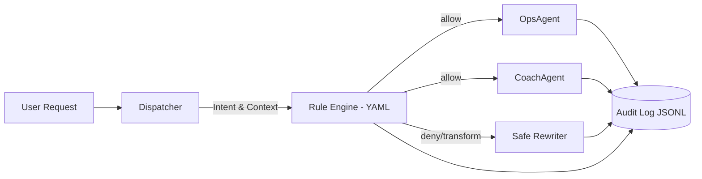

# Multi-Agent Policy Enforcement & Audit Demo

> Secure task routing, rule-based governance, and end-to-end auditability for multi-agent systems.


---

## 📜 Overview
This project demonstrates how a **multi-agent** system can operate in a secure governance environment using:
- **Policy Engine** (YAML-defined rules)
- **Audit Logging** (JSONL structured logs)

The system enables **automated task routing**, **security policy enforcement**, and **traceable logging** for sensitive operations.

---

## 🏗 Architecture


# ✨ Features
● Multi-Agent Role Switching – Dynamically route tasks to different AI agents based on intent and rules.

● Policy Enforcement – Define allowed/denied actions via YAML rules.

● Full Audit Trail – Log every decision and action into JSONL format for traceability.

Extensible Design – Add new roles, rules, and event-handling modules easily.


# 📂 Project Structure
rules/          # YAML rules
logs/           # Audit logs (JSONL)
demo/           # Demo scripts
ROADMAP.md      # Planned features
SECURITY.md     # Security policy

# Quick Start

Clone the repo
git clone https://github.com/yourname/multi-agent-policy-enforcement-demo.git
cd multi-agent-policy-enforcement-demo

Run example
python demo/demo_agent_switch.py

📸Example Output
{"timestamp": "2025-08-10T12:34:56Z", "agent": "OpsAgent", "action": "approved", "context": "database query"}

🔐 Security Notes
This repository is for demonstration purposes only.
Do not use it in production environments without thorough review.

📜 License
This project is licensed under the MIT License.

📬 Contact
For questions or suggestions, please open an issue.


本專案示範一個多代理（Multi-Agent）系統如何在安全治理場景下運作，透過 **規則引擎 (Policy Engine)** 與 **審計系統 (Audit Logging)**，達成自動化的任務分派、敏感請求防護與可追蹤性。

## ✨ 功能亮點
- **多代理角色切換**：支援多個具不同職責的 AI 代理，自動分派任務。
- **規則引擎防錯**：透過 YAML 規則檔定義允許與禁止的行為。
- **審計與可觀測性**：所有動作與規則命中事件均記錄至 JSONL 格式日誌，方便追蹤與稽核。
- **可擴充性**：可快速新增角色、規則與事件處理模組。

## 📂 專案結構
```
rules/      # 規則檔（YAML 格式）
logs/       # 範例審計日誌
demo/       # 示範腳本
SECURITY.md # 威脅模型與防護措施
ROADMAP.md  # 專案未來計畫
```

## 🚀 快速開始
```bash
git clone https://github.com/yourname/multi-agent-policy-enforcement-demo.git
cd multi-agent-policy-enforcement-demo
python demo/demo_agent_switch.py
```

## 🛡️ 與雲端安全的關聯
- 類似 AWS IAM Policy 與 GuardDuty 的規則判斷與事件紀錄機制。
- 可應用於 SOC / Cloud Security 團隊的自動化分析與治理流程。
